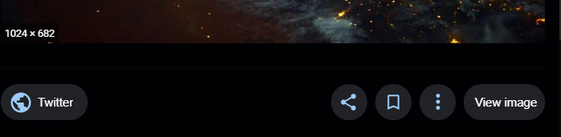

# Tampermonkey Scripts
All my userscripts for [Tampermonkey](https://tampermonkey.net/) !!

#### What is Tampermonker?
Tampermonkey is an userscript manager, available for Chrome, Firefox, Safari, Opera Next, and even Edge.

### Installation

1. Install the extension [Tampermonkey](https://tampermonkey.net/)!
1. Select a script that you wish to use and click on its name down below.
1. The script will be automatically opened by Tampermonkey.
1. Click on the _Install_ button.
1. Voila!

## Scripts

### > [google-view-image.user.js](https://raw.githubusercontent.com/StellarisStudio/Tampermonkey-Scripts/master/google-view-image.user.js)
Brings back the _View image_ button that google removed!

### > [netflix-skip-intro.user.js](https://raw.githubusercontent.com/StellarisStudio/Tampermonkey-Scripts/master/netflix-skip-intro.user.js)
Automatically click the netflix "Skip intro" button when it appears.

### > [netflix-expanded.user.js](https://raw.githubusercontent.com/StellarisStudio/Tampermonkey-Scripts/master/netflix-expanded.user.js)
More visible content, Remove the billboard promotions, Stretch video (remove black side), Centered player controls, Better Subtitles, Add a "Go Top" Button!

### > [netflix-more-categories.user.js](https://raw.githubusercontent.com/StellarisStudio/Tampermonkey-Scripts/master/netflix-more-categories.user.js)
Add a new menu entry with a lot of categories!

### > [spotify-uri-links.user.js](https://raw.githubusercontent.com/StellarisStudio/Tampermonkey-Scripts/master/spotify-uri-links.user.js)
Script to redirect open.spotify.com (artist,album,track,playlist) links to the desktop app!
_(should works everywhere)_.

### > [facebook-default-volume.user.js](https://raw.githubusercontent.com/StellarisStudio/Tampermonkey-Scripts/master/facebook-default-volume.user.js)
Automatically set the default video volume to 0.25!

### > [youtube-nyan-cat.user.js](https://raw.githubusercontent.com/StellarisStudio/Tampermonkey-Scripts/master/youtube-nyan-cat.user.js)
Brings Nyan Cat to YouTube with this custom video progress bar!
Nyan Cat is a cat (obviously ^^) with the body of a cherry pop tart who leaves a rainbow trail behind her as she flies through space!
_(works on music.youtube.com)_.

### > [direct-links-out.user.js](https://raw.githubusercontent.com/StellarisStudio/Tampermonkey-Scripts/master/direct-links-out.user.js)
Removes all "You are leaving our site" and redirection stuff from links! Which means a better anonymity and faster surfing!
###### Currently supported (main domain & subdomains):
google (with local versions) - youtube - facebook - twitter - steamcommunity - deviantart - soundcloud - upwork - addons.mozilla - pixiv - tumblr - yandex (with local versions) - vk - ok - joyreactor - 4pda - kat (kickass torrents) (with mirrors) - danieldefo - yaplaka - pikarto - taker.
